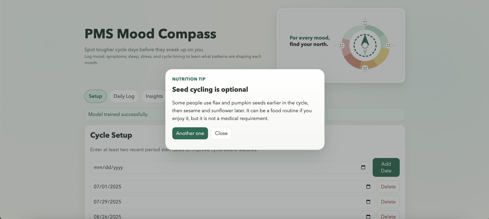
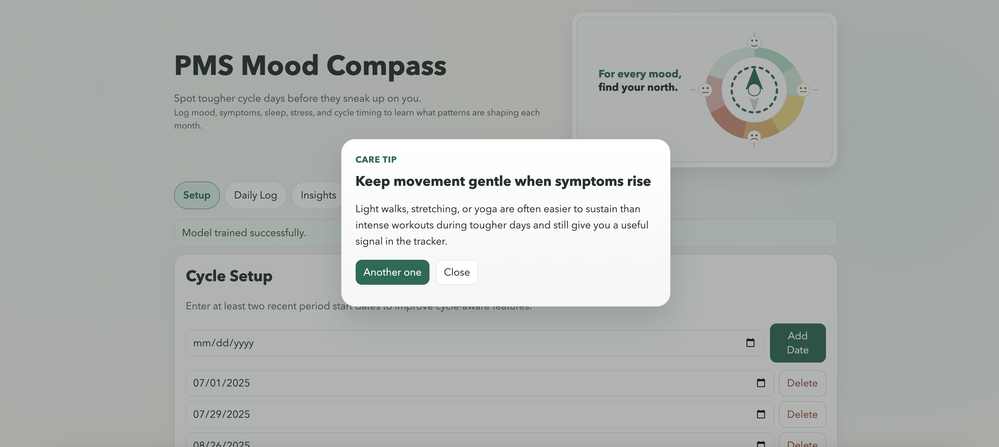
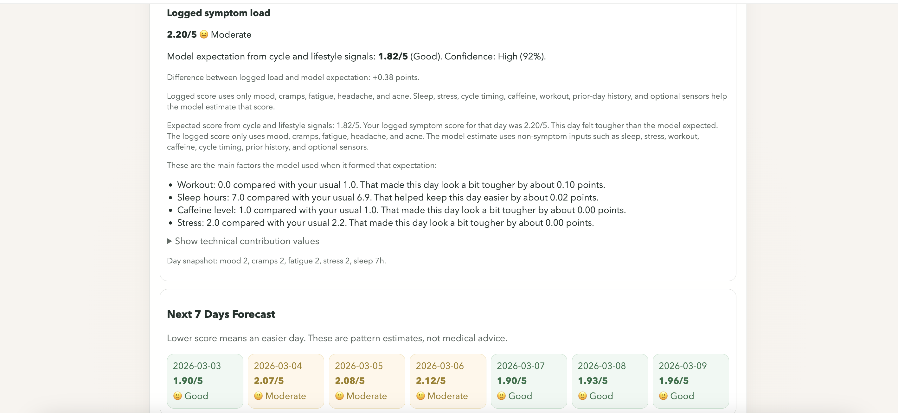
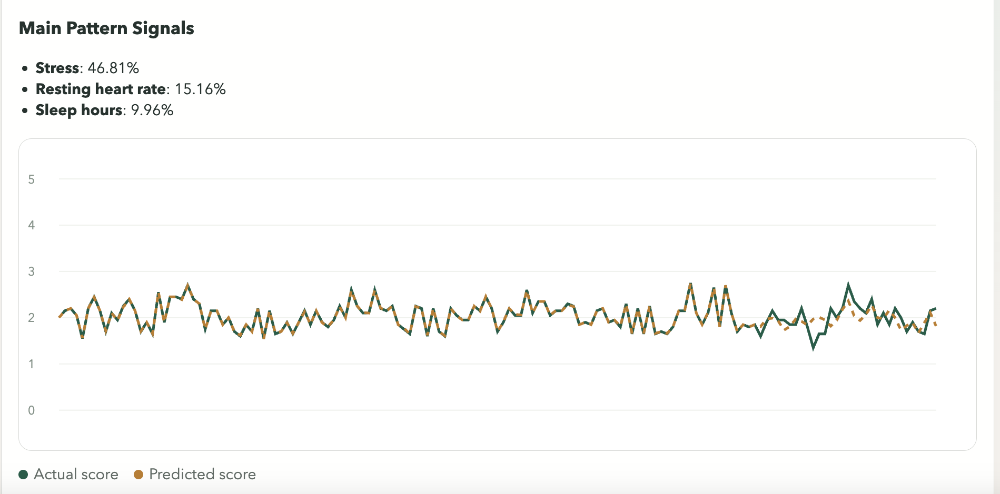

# PMS Mood Compass

PMS Mood Compass is a full-stack machine learning app for tracking cycle-related symptoms, lifestyle patterns, and daily wellbeing. It combines a web interface with a Python ML service to estimate symptom load, highlight likely pattern drivers, and forecast short-term symptom trends from user-entered daily data.

## Highlights
- full-stack machine learning app for cycle-related symptom tracking
- interpretable symptom-load modeling and short-term forecasting
- FastAPI backend with cycle-aware feature engineering
- user-facing insights designed to stay understandable

## Overview
Many cycle-tracking tools focus mainly on logging. PMS Mood Compass is designed to go a step further by turning daily entries into interpretable pattern insights.

Users can:
- log symptoms and lifestyle factors day by day
- record recent period start dates to estimate cycle timing
- generate a daily symptom-load score
- compare logged symptom load against model expectations
- see which non-symptom factors are most associated with symptom changes
- view a short-term 7-day outlook based on historical patterns

This project is informational only and is not medical advice.

## Why I Built This
I wanted to build a project that treats cycle-related self-tracking as a real machine learning problem rather than just a logging workflow. The goal was to work with noisy user-generated time-series data, build cycle-aware features, generate short-term forecasts, and present the outputs in a way that remains understandable to end users.

## What The App Measures
The app works with two related quantities:

### 1. Logged Symptom Score
This is the score calculated from the symptom sliders the user enters for a given day.

It is a **0 to 5 symptom-load score**:
- lower score = lighter symptoms
- higher score = heavier symptoms

A score like `1.83 / 5` means relatively lighter symptom load.
A score like `5.00 / 5` means very high symptom load.

### 2. Model Expectation
The machine learning model estimates the symptom load that would be expected for a given day based on non-symptom context such as:
- cycle timing
- sleep
- stress
- caffeine
- workout
- previous-day history
- optional sensor inputs

This makes it possible to compare:
- what the user logged
- what the model expected
- where the day was better or worse than expected

## Scoring Logic
The logged symptom score is built from a weighted symptom formula.

High-level interpretation:
- `Good`: under `2.0`
- `Moderate`: `2.0` to under `3.5`
- `Poor`: `3.5` and above

Mood is handled differently from the other symptom sliders:
- `0 = very low mood`
- `5 = very good mood`

Because better mood should reduce overall symptom burden, the score uses an inverted mood contribution internally.

## Machine Learning Approach
The backend is built as a FastAPI-based regression service.

At a high level, the model:
- learns from time-ordered daily logs
- uses cycle-aware and lifestyle-aware features
- predicts symptom load rather than raw symptom values
- compares performance against a simple baseline
- returns both overall and day-level interpretability outputs

The project follows an AutoML-first workflow with tree-based fallback models to balance predictive performance, inference speed, and interpretability.

## What This Project Demonstrates
This project brings together:
- product thinking for a health-oriented use case
- frontend UX for structured daily tracking
- FastAPI backend design
- machine learning problem framing for user-generated time-series data
- cycle-aware feature engineering and short-term forecasting
- interpretable outputs rather than black-box predictions alone

It is also a practical example of how machine learning can be applied to everyday self-tracking data in a way that stays useful and understandable.

## Screenshots
Screenshots are stored in the following folder structure:

```text
assets/screenshots/1.png
assets/screenshots/2.png
assets/screenshots/3.png
assets/screenshots/4.png
```

### 1. Setup Experience
<p align="center">
  
  
</p>

### 2. Logged Day Explanation And Forecast
<p align="center">
  
</p>

### 3. Cycle Tip Modal
<p align="center">
  
</p>

## Main Features
### Setup
- add, edit, and remove period start dates
- estimate cycle length from recent entries
- calculate cycle regularity
- view cycle and nutrition tip cards

### Daily Log
- log mood, cramps, fatigue, headache, acne, sleep, stress, caffeine, workout, and optional sensor values
- save, edit, delete, import, and export entries
- keep data available within the current browser session

### Insights
- train or refresh the model on current session data
- compare model performance against a simple baseline
- surface major pattern signals
- explain a selected logged day
- forecast the next 7 days

## Core ML Idea
Instead of predicting individual symptoms independently, the model predicts a daily symptom-load score using non-symptom context such as cycle timing, sleep, stress, caffeine intake, workout activity, previous-day history, and optional sensor inputs.

This makes it possible to compare:
- what the user logged
- what the model expected
- where the day was better or worse than expected

## Technical Stack
- Frontend: Next.js (App Router) + TypeScript
- Backend: FastAPI + Python
- ML: AutoML-assisted non-linear regression with boosted-tree fallbacks
- Data: pandas, NumPy, Pydantic
- Persistence: session-based frontend storage + backend model artifacts

## Repository Structure
```text
/  
  frontend/      Next.js application
  backend/       FastAPI ML service
  assets/        Screenshots used in the README
  sample_data.csv
  README.md
  .gitignore
```

## Limitations
- This project is informational only and not intended for diagnosis or treatment.
- Model outputs reflect learned associations from logged data, not causal conclusions.
- Insight quality depends on the consistency and quantity of user-entered data.
- Forecasts are designed to be informative, not clinically validated.

## Author
Created by **Shwetha Tinnium Raju**.
